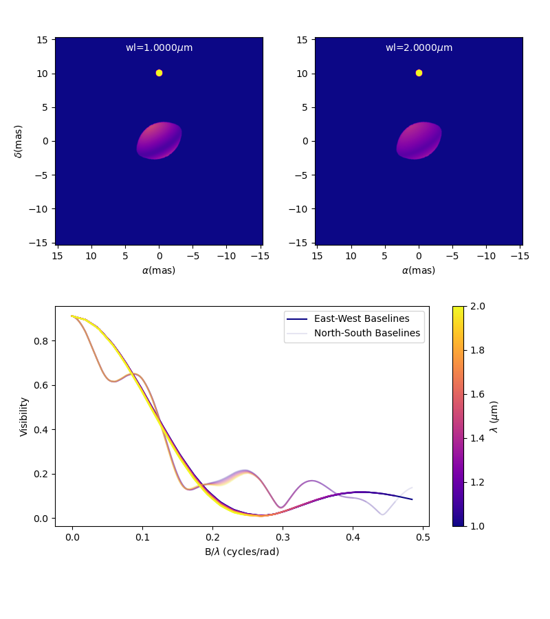

<h1 align="center">

</h1> 

Oimodeler is a modular modelling tool for optical interferometry

* Installation: https://oimodeler.readthedocs.io/en/latest/installation.html
* Usage: https://oimodeler.readthedocs.io/en/latest/getting_started.html
* Documentation https://oimodeler.readthedocs.io/en/latest/
* Contributing: https://oimodeler.readthedocs.io/en/latest/expandingSoftware.html
* Source code: https://github.com/oimodeler/oimodeler
* Bug reports: https://github.com/oimodeler/oimodeler/issues

## Features
### Modules:
* **oimModel** : Create models with various components as bricks
* **oimData** :  Handle interferometric, spectroscopic and photometric data
* **oimDataFilter** : Filtering and modifying data (wavlengths range cut, smoothing, removing flags...)
* **oimSimulator** : Main class holding evertyhing together and producing final results :plots, tables...
* **oimFitter** : Define and perform model-fitting
* **oimPlot** : Plotting tools
* **oimUtils** : Various utility for optical-interferometry

### :warning: Under Development :warning:
The following modules have only been partially implemented
* oimModel: Fourier and image plans components. Chromaticity and time dependence of components and parameters.
* oimData: only interferometric data
* oimDataFilter: Wavlengths range cut, datatype selection
* oimSimulator: Simulated data and chi2 computation with filtering
* oimPlot: Basics plots of oifits data (see examples below)
* oimUtils: mainly helpers for oifits format (get information, create new tables...)

## Examples

For more examples see: https://oimodeler.readthedocs.io/en/latest/examples.html

> Various example scripts are available in the `examples` directory. 

This plot has been created with the `createModelChromatic.py` script:

Here is the resulting plot from the `oimodel_Create_simulator_data.py` script.
It plots data of a partly resolved binary created with:
- the [ASPRO](https://www.jmmc.fr/english/tools/proposal-preparation/aspro/) software from JMMC (including realistic noise)
- oimodeler using a shifted uniform disk + unresolved component

Here is a plot showing a model consisting of a fast rotating star plus a uniform disk.
Chromatic images of fast rotator are computed with an external function encapsulated into a oimodeler component.
The uniform disk is a simple Fourier-based component. The code is in the `createCustomComponentImageFastRotator.py`

## Contact
[Anthony Meilland](https://github.com/AnthonyMeilland)
